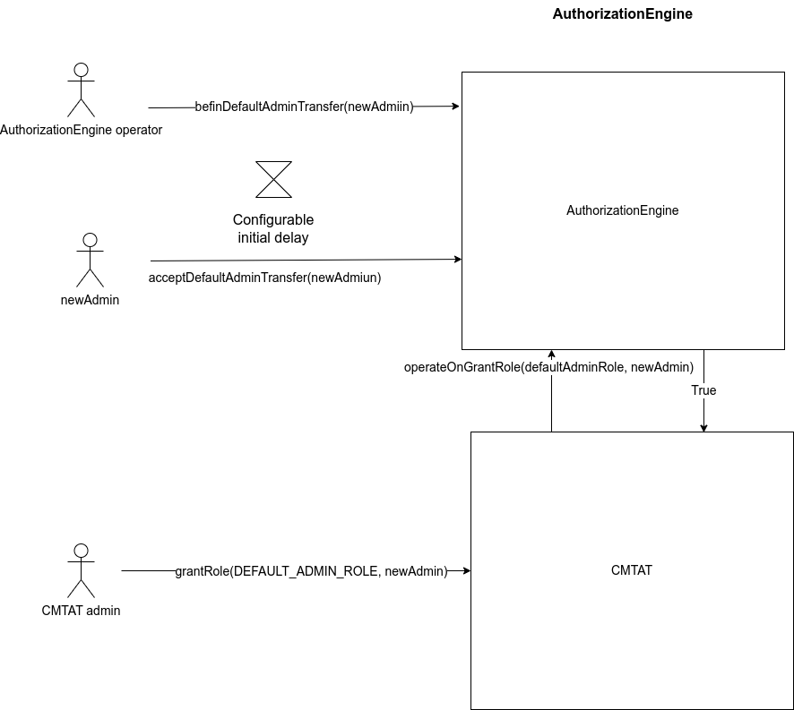

# AuthorizationEngine

> This project is not audited !
> It is provided to show an example of a possible AuthorizationEngine as defined in the CMTAT.
>
> If you want to use this project, perform your own verification or send an email to [admin@cmta.ch](mailto:admin@cmta.ch).


# Overview

This `AuthorizationEngine` adds a supplementary check on the function `grantRole`from the CMTAT

- Enforces a 2-step process to transfer the `DEFAULT_ADMIN_ROLE` to another account.

- Enforces a configurable delay between the two steps, with the ability to cancel before the transfer is accepted.

- The delay can be changed by scheduling, see [`changeDefaultAdminDelay`](https://docs.openzeppelin.com/contracts/5.x/api/access#AccessControlDefaultAdminRules-changeDefaultAdminDelay-uint48-).

The behavior and code the code (under MIT License) come mainly from the OpenZeppelin version AcessControlDefaultAdminRule.

Nevertheless, contrary to OpenZeppelin, these checks are NOT performed:

- Only one account holds the `DEFAULT_ADMIN_ROLE` since deployment until it’s potentially renounced.

- It is not possible to use another role to manage the `DEFAULT_ADMIN_ROLE`.

See [https://docs.openzeppelin.com/contracts/5.x/api/access#AccessControlDefaultAdminRules](https://docs.openzeppelin.com/contracts/5.x/api/access#AccessControlDefaultAdminRules)

## Schema




## Usage

*Explain how it works.*


## Toolchain installation

The contracts are developed and tested with [Foundry](https://book.getfoundry.sh), a smart contract development toolchain.

To install the Foundry suite, please refer to the official instructions in the [Foundry book](https://book.getfoundry.sh/getting-started/installation).

## Initialization

You must first initialize the submodules, with

```
forge install
```

See also the command's [documentation](https://book.getfoundry.sh/reference/forge/forge-install).

Later you can update all the submodules with:

```
forge update
```

See also the command's [documentation](https://book.getfoundry.sh/reference/forge/forge-update).


## Compilation

The official documentation is available in the Foundry [website](https://book.getfoundry.sh/reference/forge/build-commands) 

```
 forge build --contracts src/RuleEngine.sol
```

```
 forge build --contracts src/RuleWhiteList.sol
```

## Testing

You can run the tests with

```
forge test
```

To run a specific test, use

```
forge test --match-contract <contract name> --match-test <function name>
```

See also the test framework's [official documentation](https://book.getfoundry.sh/forge/tests), and that of the [test commands](https://book.getfoundry.sh/reference/forge/test-commands).

### Coverage

* Perform a code coverage

```
forge coverage
```

* Generate LCOV report

```
forge coverage --report lcov
```

- Generate `index.html`

```bash
forge coverage --report lcov && genhtml lcov.info --branch-coverage --output-dir coverage
```

See [Solidity Coverage in VS Code with Foundry](https://mirror.xyz/devanon.eth/RrDvKPnlD-pmpuW7hQeR5wWdVjklrpOgPCOA-PJkWFU) & [Foundry forge coverage](https://www.rareskills.io/post/foundry-forge-coverage)
